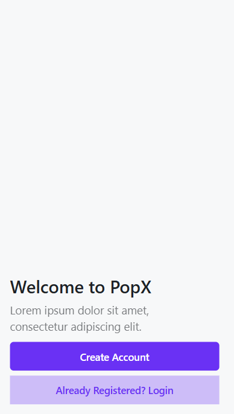
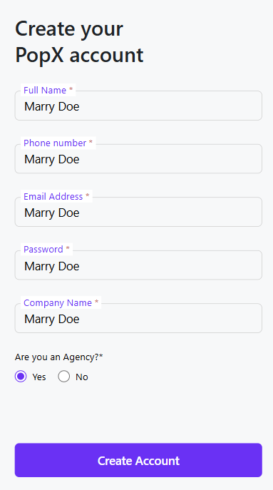
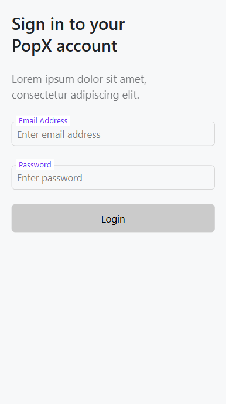
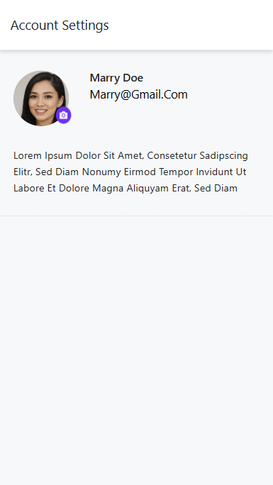

# Educase UI - Mobile View Only

This repository contains only the front-end code for the given design. The project is a **static UI** without any backend or functionality. All input fields are **read-only**, and the design is meant **only for mobile view**, not desktop.

## 🔗 Live Preview

You can access each page using the following links:

- **Welcome Page**: [https://educase18.netlify.app/](https://educase18.netlify.app/)
- **Create Account Page**: [https://educase18.netlify.app/signup](https://educase18.netlify.app/signup)
- **Login Page**: [https://educase18.netlify.app/signin](https://educase18.netlify.app/signin)
- **Profile Page**: [https://educase18.netlify.app/profile](https://educase18.netlify.app/profile)

## 📸 Screenshots  
Below are previews of each page:

### **Welcome Page**


### **Create Account Page**


### **Login Page**


### **Profile Page**


## 📌 Features

- Static UI with no backend.
- All input fields are **read-only**.
- Designed **only for mobile view**.

## 📂 Tech Stack

- **Framework**: React + Vite
- **Styling**: Tailwind

## 🚀 Setup (For Local Development)

If you want to run this project locally:

```sh
# Clone the repository
git clone https://github.com/Pradyumn-Chaudhary/Educase

# Navigate to the project folder
cd Educase

# Install dependencies
npm install

# Run the development server
npm run dev
```

## ❗ Note

Since this project is only for UI purposes, there is no backend or functional logic implemented. If you need to integrate functionality, you will need to connect it with an appropriate backend service.

---

📢 **For any issues, feel free to reach out!**

